# enterprise-sso-mfa-auth-lab

本プロジェクトは、Cisco Duo 等の MFA / SSO 製品導入を想定した、企業向け認証基盤の学習・検証用サンプルです。実製品の複製ではなく、SSO、MFA、OIDC/SAML、RADIUS/LDAP/AD連携、認証ポリシー、認証ログ、設計・構築・試験観点を整理することを目的としています。

## 重要な注意

- 本プロジェクトは学習・検証用であり、Cisco Duo公式製品の複製ではありません。
- Cisco / Duo のロゴ、商標画像、公式UIの模倣は含めていません。
- Client Secret、API Key、Integration Key、Secret Key、電話番号、QRコード、管理者URLなどの機密情報は含めていません。
- 実案件、実会社、実顧客名は使用せず、架空の社内業務システムとして表現しています。

## プロジェクト概要

Duo Trial / Duo Free 環境を使ったOIDC/SSO/MFA連携を検討する前段として、Mock SSO / Mock MFAで認証フロー、ユーザー管理、アプリケーション管理、ポリシー管理、監査ログ確認、VPN/RADIUS想定フローを確認できます。Duo未経験でも、SSO/MFA/ID連携/設計構築の理解を示すためのサンプルとして利用できます。

## 想定業務

| 観点 | 内容 |
|---|---|
| SSO / MFA 認証基盤設計 | Webアプリ、管理画面、VPNを対象に認証方式を整理 |
| OIDC / SAML / RADIUS / LDAP / AD | 方式ごとの役割と接続点を画面・文書で確認 |
| 認証ポリシー | グループ、アプリ、アクセス条件ごとのMFA要否を定義 |
| 認証ログ確認 | 成功、失敗、拒否、ロックの監査観点を確認 |
| 手順書・試験仕様書 | docs配下に提出想定の文書を配置 |

## システム構成図

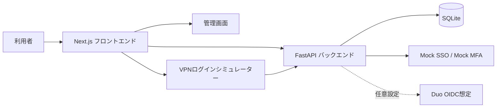

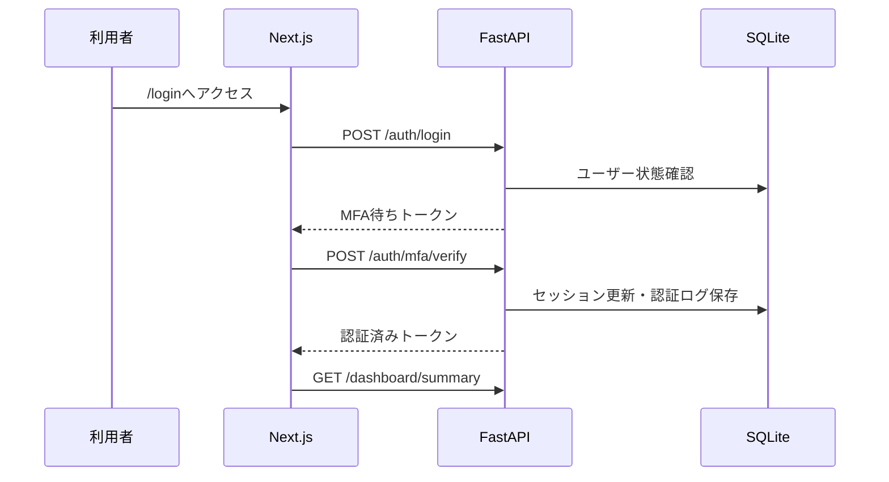

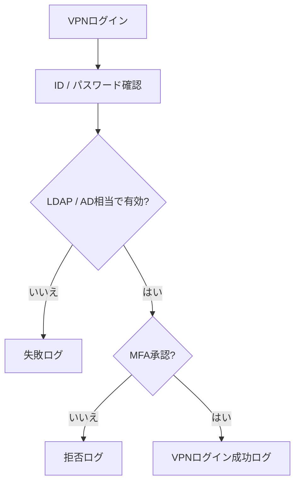

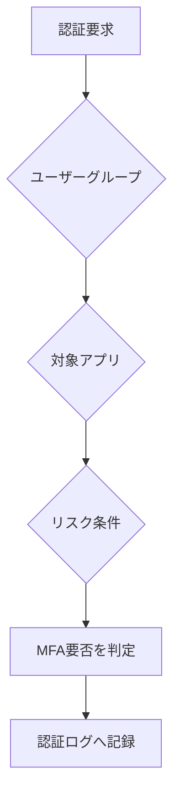

## ディレクトリ構成

| パス | 内容 |
|---|---|
| backend/app | FastAPI、SQLAlchemyモデル、seed、API本体 |
| backend/tests | pytestによるAPIテスト |
| frontend/app | Next.js App Routerの日本語UI |
| frontend/scripts/screenshots.mjs | Playwrightスクリーンショット取得 |
| docs | 設計書、構築手順書、試験仕様書、運用手順書 |
| docs/screenshots | README埋め込み用スクリーンショット |

## セットアップ手順

```bash
cp .env.example .env
docker compose up --build
```

ローカル実行の場合:

```bash
cd backend
python -m venv .venv
.venv\Scripts\pip install -r requirements.txt
python -m app.seed
uvicorn app.main:app --reload --port 8000

cd ../frontend
npm install
npm run dev
```

## 便利コマンド

| コマンド | 内容 |
|---|---|
| make setup | Python/Node依存関係をインストール |
| make up | Docker Composeで起動 |
| make down | Docker Composeを停止 |
| make seed | SQLite初期データ投入 |
| make test | pytest実行 |
| make screenshots | Playwrightでスクリーンショット生成 |

## 初期データ

### ユーザー

| ユーザーID | 名前 | グループ | ロール | MFA | 状態 |
|---|---|---|---|---|---|
| admin01 | 管理者 太郎 | administrators | 管理者 | 必須 | 有効 |
| employee01 | 社員 花子 | employees | 一般社員 | 必須 | 有効 |
| employee02 | 社員 一郎 | employees | 一般社員 | 必須 | 有効 |
| contractor01 | 協力会社 健 | contractors | 契約社員 | 必須 | 有効 |
| locked01 | ロック 太郎 | employees | 一般社員 | 必須 | ロック中 |

初期パスワードは検証用に全ユーザー `Password123!` です。

### アプリケーション

| アプリID | 名前 | 方式 | MFA | 対象 |
|---|---|---|---|---|
| app-portal | 社内ポータル | OIDC | 必須 | employees, administrators |
| app-dashboard | 業務ダッシュボード | OIDC | 必須 | employees, administrators |
| app-admin | 管理者コンソール | SAML想定 | 強制 | administrators |
| app-contractor | 契約社員向け申請システム | OIDC | 必須 | contractors |
| app-vpn | VPNログインシミュレーター | RADIUS想定 | 必須 | employees, administrators |

## 実行結果スクリーンショット

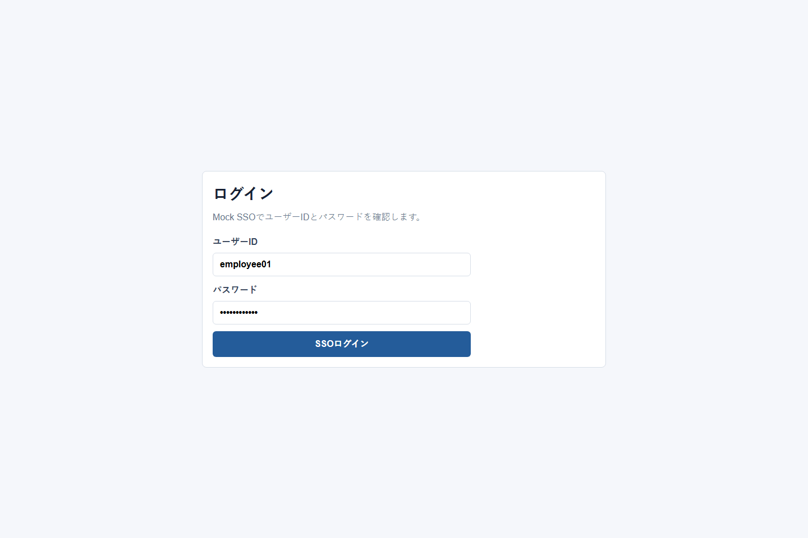
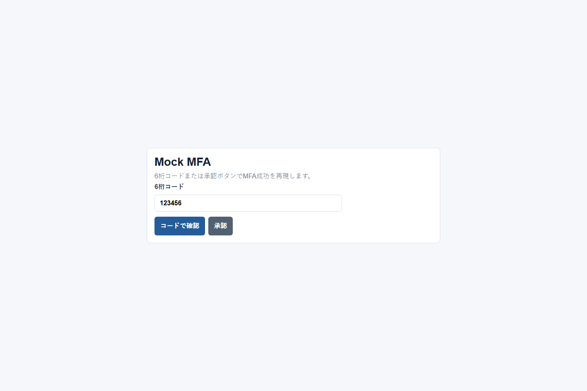
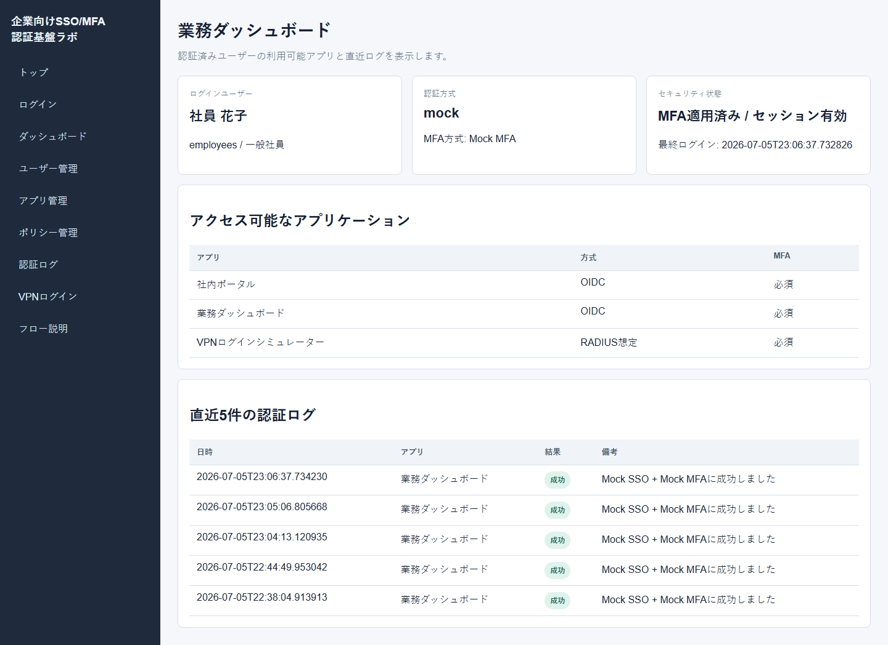
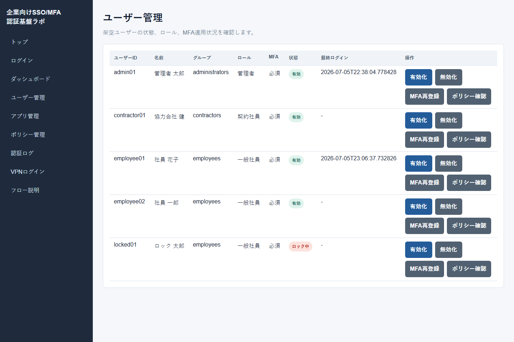
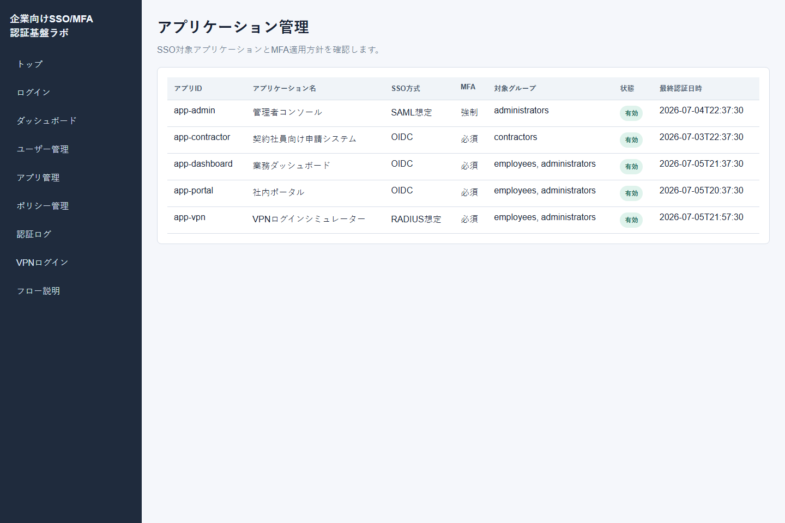
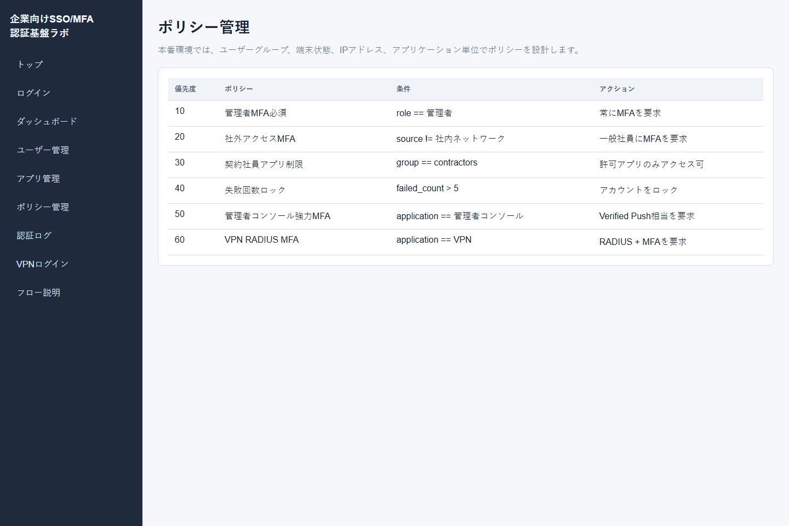
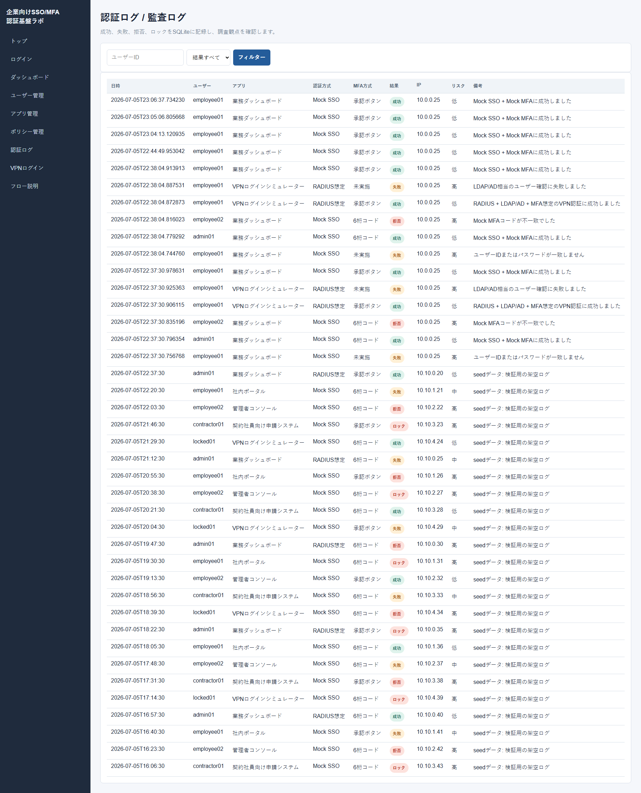
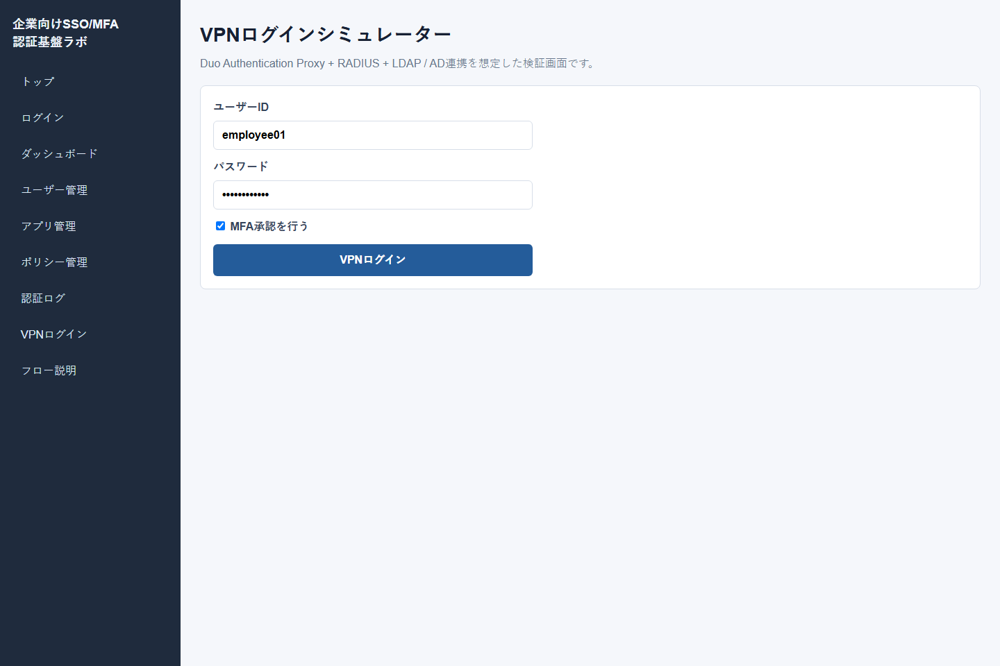

## 試験観点

| No | 観点 | 期待結果 |
|---|---|---|
| 1 | 正常ログイン | MFA画面へ遷移 |
| 2 | MFA成功 | ダッシュボード表示 |
| 3 | MFA拒否 | 拒否ログが記録される |
| 4 | パスワード誤り | 失敗メッセージ表示 |
| 5 | ロックユーザー | ロック扱いでログイン不可 |
| 6 | 権限不足 | 対象外アプリを利用不可と判断 |
| 7 | 契約社員アクセス制限 | 契約社員向けアプリのみ許可 |
| 8 | 管理者コンソール | 強いMFA要求想定を確認 |
| 9 | VPNログイン成功 | RADIUS想定ログが成功で保存 |
| 10 | VPNログイン失敗 | 失敗ログが保存 |
| 11 | 認証ログ出力 | 画面にログが表示される |

## 障害調査観点

OIDC Redirect URI不一致、Client Secret誤り、SAML Metadata不一致、証明書期限切れ、LDAP接続失敗、RADIUS応答なし、MFA Push未達、時刻同期ずれ、FW/Proxy/DNS問題、ユーザーグループ不一致、ポリシー設定ミス、認証ログ確認手順をdocsに整理しています。

## Duo Trial連携手順

1. Duo Admin PanelでOIDCアプリケーションを作成します。
2. Client ID / Client Secret / Issuerを確認します。
3. Redirect URIとして `http://localhost:3000/auth/callback` を登録します。
4. `.env` に値を設定します。実値はリポジトリに含めません。
5. `AUTH_MODE=duo_oidc` に変更します。
6. ログイン検証を行い、認証ログを確認します。

## API一覧

`GET /health`, `POST /auth/login`, `POST /auth/mfa/verify`, `POST /auth/logout`, `GET /me`, `GET /users`, `GET /users/{user_id}`, `GET /applications`, `GET /policies`, `GET /auth-logs`, `POST /vpn/login`, `GET /dashboard/summary`

## 選考提出用コメント

Cisco Duo自体は未経験ですが、SSO/MFA/ID連携の理解を深めるため、Duo導入を想定した認証基盤検証サンプルを作成しました。本サンプルでは、テスト用Webアプリケーションに対してSSO/MFA認証を適用し、ユーザー・アプリケーション・ポリシー設計、認証ログ確認、基本設計書、構築手順書、試験仕様書、障害調査観点を整理しています。Duo導入案件で必要となる認証フロー、ID連携、設計・構築・試験観点の理解を示すための参考資料として作成しています。
